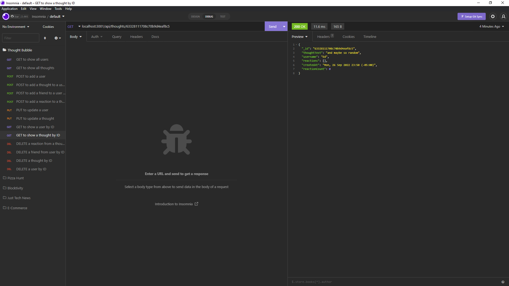

# Thought Bubble

## Description

This is an API for a social network

## Usage

- Access and download the repo [here](https://github.com/indy6678/psychic-octo-waddle)
- Install dependencies.
- Run 'node server'
- Watch the tutorial [here!](https://drive.google.com/file/d/1uXgEnMyrOvDCFCpr_N-5r-H_OykEfZmH/view)
- 

## License

- MIT License